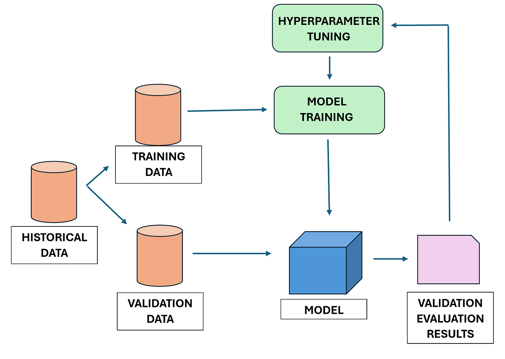

# Model Tuning and Optimization
 

Every machine learning model has a hidden set of dials — learning rates, tree depths, regularization strengths — waiting to be turned. Get them wrong and your model underperforms no matter how good the algorithm is. Get them right, and a decent model becomes a great one.

This repo is a 7-day, hands-on journey from brute-force search to smart, automated optimization. You'll go from manually sweeping through parameter grids to letting Bayesian methods do the thinking for you, pick up the regularization and validation skills that keep your tuning honest, and finish by building and optimizing a model of your own from scratch.

## 📋 Overview

Each day stacks on the last:

- **Days 1–3** build your search toolkit — from the basics of hyperparameters to Grid Search, Random Search, and Bayesian Optimization
- **Day 3** also comes with a role-play showdown where you defend your optimization strategy under pressure
- **Days 4–5** cover the guardrails — regularization and cross-validation — so your tuned model actually generalizes
- **Day 6** automates the whole search with `GridSearchCV` and `RandomizedSearchCV`
- **Day 7** puts it all together in a capstone project: build, tune, and evaluate a final model end-to-end

## 🗓️ Curriculum

| Day | Topic 
|-----|-------
| 1 | Introduction to Hyperparameter Tuning
| 2 | Grid Search and Random Search 
| 3 | Advanced Hyperparameter Tuning with Bayesian Optimization 
| 4 | Regularization Techniques for Model Optimization 
| 5 | Cross-Validation and Model Evaluation Techniques 
| 6 | Automated Hyperparameter Tuning with GridSearchCV and RandomizedSearchCV 
| 7 | Optimization Project — Building and Tuning a Final Model 

## 🎯 What You'll Walk Away With

- A real understanding of *why* hyperparameters make or break model performance
 
- The instincts to choose between Grid Search, Random Search, and Bayesian Optimization — not just how to run them
- The ability to fight overfitting with regularization (L1, L2, Elastic Net, and friends)
- Rock-solid model evaluation using cross-validation, so your results hold up outside the training set
- The skills to automate the entire tuning process with `GridSearchCV` and `RandomizedSearchCV`
- A finished, fully-tuned model you built and optimized yourself — proof you can do this end-to-end

## 🛠️ Tech Stack

- Python
- scikit-learn
- NumPy / Pandas
- Jupyter Notebook

## 📁 Repository Structure

```
Model-Tuning-and-Optimization/
├── day1_intro_to_hyperparameter_tuning/
├── day2_grid_search_and_random_search/
├── day3_bayesian_optimization/
├── role_play_3_smarter_search/
├── day4_regularization_techniques/
├── day5_cross_validation_and_evaluation/
├── day6_automated_tuning_gridsearchcv_randomizedsearchcv/
├── day7_optimization_project/
└── README.md
```

## 🚀 Getting Started

1. Clone the repository
   ```bash
   git clone https://github.com/<your-username>/Model-Tuning-and-Optimization.git
   cd Model-Tuning-and-Optimization
   ```
2. Install dependencies
   ```bash
   pip install -r requirements.txt
   ```
3. Work through each day's folder in order, running the notebooks and completing the exercises.


## 🏁 The Capstone

**Day 7: Optimization Project** — No more guided exercises. Take everything from the week and build, tune, and evaluate a final machine learning model from the ground up. This is where theory becomes a model you can point to and say, "I optimized that."

## 📄 License

This project is licensed under the MIT License — see the [LICENSE](LICENSE) file for details.
